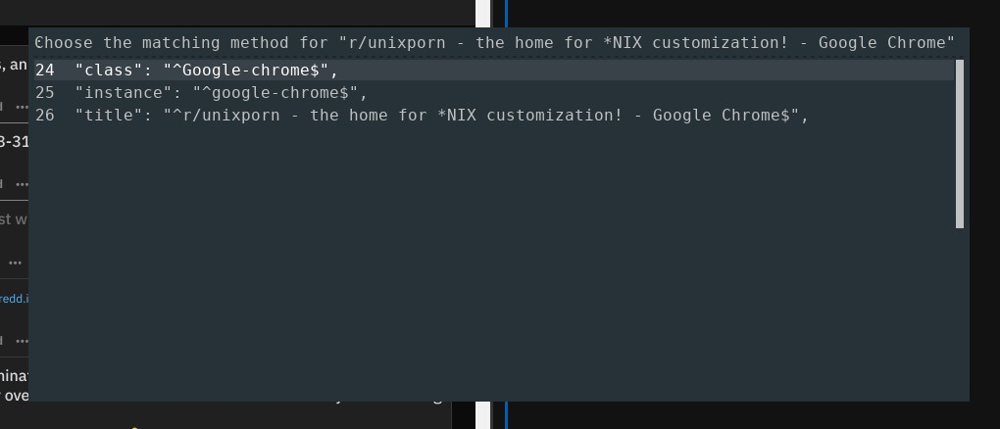

# i3-layout-manager
Saving, loading and managing layouts for i3wm.

Video:

[](https://www.youtube.com/watch?v=Q0qlUfG_lZ0)

Features:
* saving a layout (including floating windows)
* restoring the layout on any workspace
* rearranging existing windows as well as preparing the layout for new windows
* layout management using _rofi_

## Preamble - don't worry, I solved all of this

i3 window manager supports saving and loading of window layouts, however, the features are bare-bone and partially missing.
According to the [manual](https://i3wm.org/docs/layout-saving.html), the layout tree can be exported into a JSON file.
The file contains a description of the containers of a workspace with prefilled (and commented) potential matching rules for the windows.
The user is supposed to uncomment the desired one (and modify them) and delete the unused ones.
Moreover, the user should add a surrounding root container which is missing in the file (this baffles me, why can't they save it too?).

So doing it manually (which I don't want) consists of following steps, as described at [i3wm.org](https://i3wm.org/docs/layout-saving.html):
1. export the workspace into JSON using ```i3-save-tree --workspace ...```
2. edit the JSON to match your desired matching rules for the windows
3. wrap the file in a root node, which defines the root split.
4. when needed, load the layout using ```i3-append ...```

However, this plan has flaws.
It's not scalable, it's not automated and loading a layout does not work when windows are already present in the current workspace.
To fix it, I built this **i3-layout-manager**.
Currently, its a hacky-type of a shell script, but feel free to contribute :-).

## How does it work?

1. The workspace tree is exported using ```i3-save-tree --workspace ...```
2. The tree for all workspaces on the currently focused monitor exported using ```i3-save-tree --output ...```
3. The location of the current workspace in the all-tree is found by matching the workspace-tree file on the monitor-tree file.
4. The parameters of the root split are extracted, and the workspace tree is wrapped in a new split.
5. The floating windows are extracted from within and appended behind the root split.
6. The user is then asked about how should the windows be matched. The options are:
  * All by _instance_ (instance will be uncommented for all windows)
  * Match any window to any placeholder
  * Choose an option for each window. The user will be asked to choose between the _class_, _instance_ and _title_ for each window. The tree file will be modified automatically according to the selected options.
  
7. After that, the tree is saved and ready to be loaded.
8. The user can load the layout either before opening windows, which creates placeholders, or after, which adds the existing windows to the layout. The second part normally does not work.
9. To apply a layout, we first move all windows containing a process from the workspace using `xdotool`, which leaves only placeholders. Then we kill all the old placeholders before we apply the layout, which spawns new placeholders in the correct places. Lastly, we move the windows back, which triggers the _swallow_ mechanism in the same way, as newly create windows do.

## How to use it?

* By directly running the script
```bash
./layout_manager.sh
```
It uses *rofi* to interact with the user, no file editing or coding is required.
You can bind the script to an i3 key combination.
* The layout manager can load a layout by running
```bssh
./layout_manager.sh <layout_name>
```
which is useful for automation. If the `layout_name` ends with .json, the manager treats the argument as a path to the particular layout file.

## Layout files

The layout files are stored by default in `~/.layouts` or in `~/.config/i3-layout-manager/layouts`, depending on your `$XDG_CONFIG_HOME`.

## Dependencies

* vim/nvim
* jq
* i3
* rofi
* xdotool
* x11-xserver-utils
* indent, libanyevent-i3-perl

```bash
sudo apt install jq vim rofi xdotool x11-xserver-utils indent libanyevent-i3-perl
```

## FAQ

* **Does it work on floating windows?**

Yes, sometimes. Some programs behave strangly, e.g., the *Thunar file* manager fails to load into a floating place holder.

* **Will it run the programs for me?**

Nope. It is not intended to do that. The layout manager only automates the already built-in features of i3. Running programs is a different matter than applying layout.

* **Does it move windows across workspaces?**

No, it only affects the current workspace. However, layouts can be used on another workspace than they had been created on.

* **Why do you use vim for the automated file editing?**

Vim is great for this kind of work. A simple one-liner can do complex edits which would be difficult to program even using, e.g., python. Thanks to this, the layout manager was hacked up in a single day.

